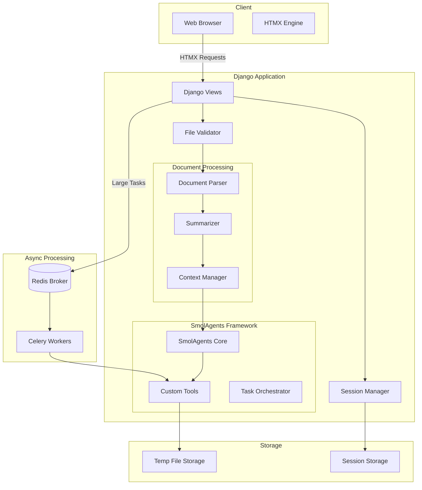
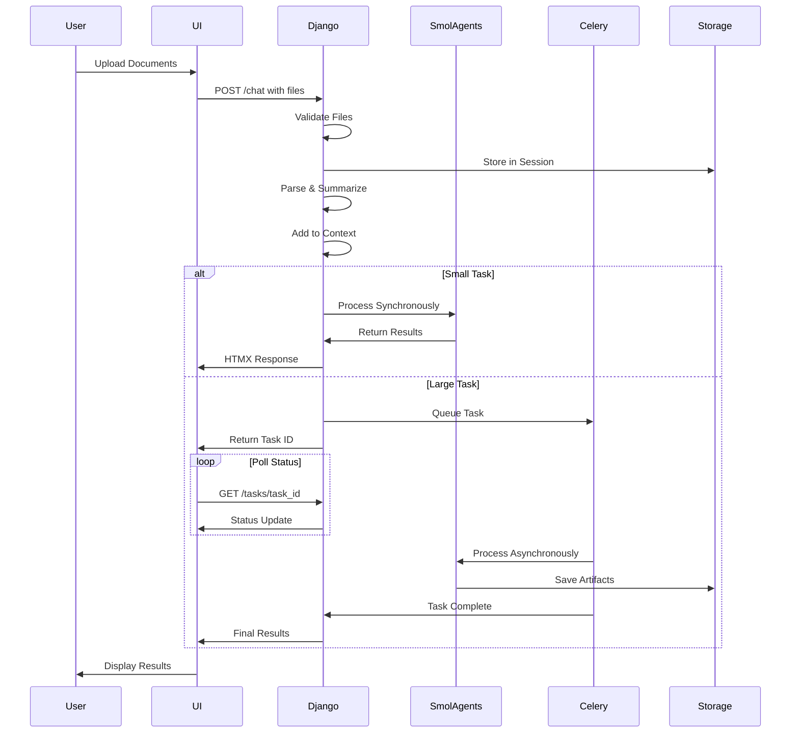
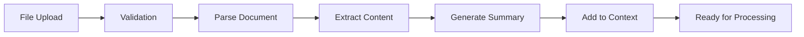
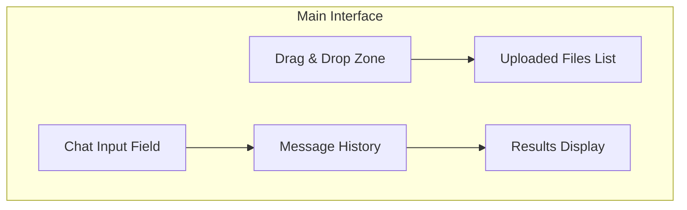
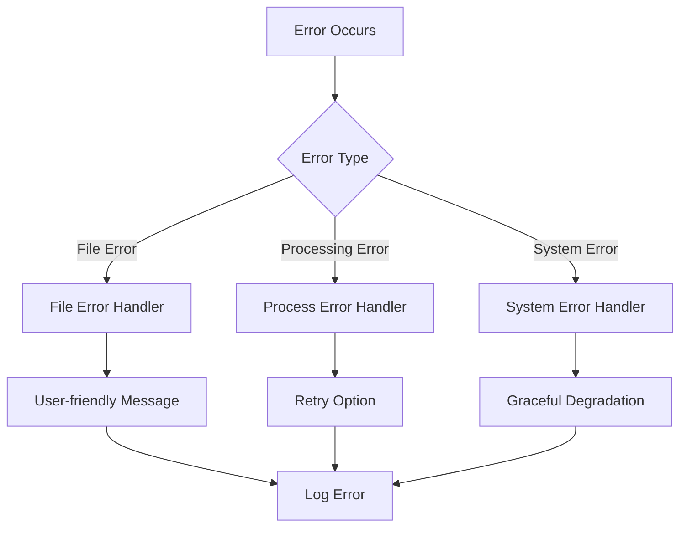
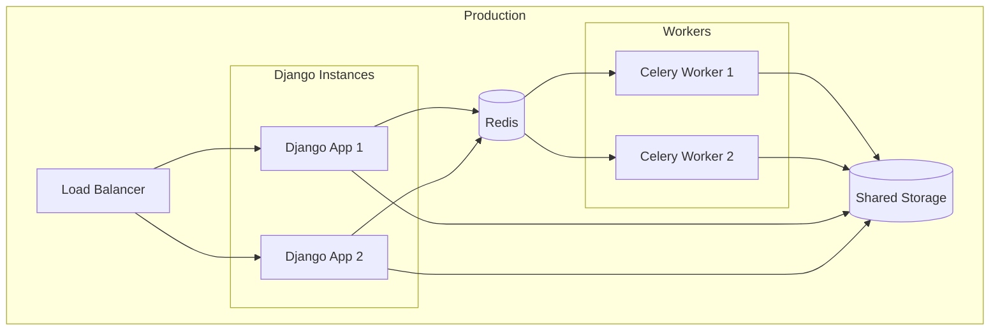

# Ultra PDF Chatbot 3000 - Architecture Document

## System Overview

A Django-based chatbot system that enables users to interact with multiple documents (PDF, Excel, Word) simultaneously, perform modifications, generate charts, and receive processed results - all within a session-based context.

## Core Architecture



## Data Flow



## Component Details

### 1. File Processing Pipeline



### 2. SmolAgents Tools Architecture

| Tool | Purpose | Libraries | Input | Output |
|------|---------|-----------|-------|--------|
| `parse_pdf` | Extract text/tables from PDF | PyPDF2/pdfplumber | file_path | structured_data |
| `parse_excel` | Read Excel data | pandas | file_path | dataframe |
| `parse_word` | Extract Word content | python-docx | file_path | document_content |
| `modify_excel` | Edit Excel files | pandas, XlsxWriter | file_path, instructions | modified_file |
| `modify_word` | Edit Word documents | python-docx | file_path, instructions, images | modified_file |
| `generate_chart` | Create visualizations | matplotlib | data_spec | png_path |
| `save_artifact` | Persist results | builtin | payload, suffix | artifact_id |

### 3. Session Management

- **Session-based storage**: Documents tied to Django session
- **Document limit**: Maximum 20 documents per session
- **Context window**: Summaries of all documents available to agent
- **Cleanup**: Automatic cleanup on session end
- **Storage structure**:
  ```
  /tmp/uploads/
    └── session_<id>/
        ├── documents/
        │   ├── doc1.pdf
        │   ├── doc2.xlsx
        │   └── doc3.docx
        ├── summaries/
        │   └── context.json
        └── outputs/
            ├── chart_1.png
            └── modified_doc.xlsx
  ```

### 4. UI Components



## Technology Stack

### Backend
- **Python**: 3.11+
- **Django**: 5.0+
- **Celery**: 5.3+ (async tasks)
- **Redis**: 7.0+ (message broker & cache)
- **Gunicorn**: Production WSGI server

### Document Processing
- **PyPDF2/pdfplumber**: PDF parsing
- **pandas**: Excel/CSV processing
- **python-docx**: Word document manipulation
- **XlsxWriter**: Excel chart generation
- **matplotlib**: Chart/graph generation
- **Pillow**: Image processing

### Frontend
- **Django Templates**: Server-side rendering
- **HTMX**: Dynamic updates without JavaScript
- **Tailwind CSS**: Utility-first styling
- **Alpine.js**: Minimal reactivity (optional)

### AI/Agent Framework
- **SmolAgents**: Tool orchestration
- **LangChain** (optional): Document summarization
- **OpenAI/Local LLM**: Text generation

## Security Measures

1. **File Upload Security**:
   - Extension whitelist: .pdf, .xlsx, .docx only
   - MIME type validation
   - File size limit: 50MB default
   - Virus scanning (optional ClamAV integration)

2. **Session Security**:
   - CSRF protection
   - Session timeout: 2 hours
   - Secure cookie settings
   - Rate limiting per session

3. **Execution Security**:
   - No arbitrary code execution
   - Sandboxed tool execution
   - Resource limits (CPU, memory)
   - Task timeouts (120s default)

## Performance Considerations

1. **Optimization Strategies**:
   - Lazy loading of documents
   - Summary caching in Redis
   - Chunked file uploads
   - Progressive rendering with HTMX

2. **Scalability**:
   - Horizontal scaling with multiple Celery workers
   - Redis cluster for high availability
   - CDN for static assets
   - Database connection pooling

## Error Handling



## Deployment Architecture



## API Endpoints

| Endpoint | Method | Purpose | Request | Response |
|----------|--------|---------|---------|----------|
| `/` | GET | Main chat interface | - | HTML page |
| `/chat` | POST | Submit chat request | files + text | HTMX fragment |
| `/tasks/<id>` | GET | Check task status | - | JSON/HTMX |
| `/download/<id>` | GET | Download artifact | - | File response |
| `/session/clear` | POST | Clear session | - | Redirect |

## Development Workflow

1. **Local Development**:
   ```bash
   # Start Redis
   redis-server
   
   # Start Celery
   celery -A chatbot worker -l info
   
   # Start Django
   python manage.py runserver
   ```

2. **Testing Strategy**:
   - Unit tests for tools
   - Integration tests for document processing
   - End-to-end tests with Selenium
   - Performance tests with Locust

3. **CI/CD Pipeline**:
   - GitHub Actions for testing
   - Docker containerization
   - Kubernetes deployment (optional)

## Configuration

```python
# settings.py key configurations
ALLOWED_FILE_EXTENSIONS = ['.pdf', '.xlsx', '.docx']
MAX_FILE_SIZE = 50 * 1024 * 1024  # 50MB
MAX_DOCUMENTS_PER_SESSION = 20
SESSION_TIMEOUT = 7200  # 2 hours
CELERY_TASK_TIME_LIMIT = 120  # seconds
TEMP_FILE_CLEANUP_HOURS = 24
```

## Future Enhancements

1. **Phase 2**:
   - OCR support for scanned PDFs
   - Multi-language support
   - Cloud storage integration (S3/GCS)
   - WebSocket for real-time updates

2. **Phase 3**:
   - User authentication system
   - Document versioning
   - Collaborative editing
   - API for third-party integrations

## Success Metrics

- File processing success rate > 95%
- Average response time < 2s for sync operations
- Session stability > 99%
- User task completion rate > 80%