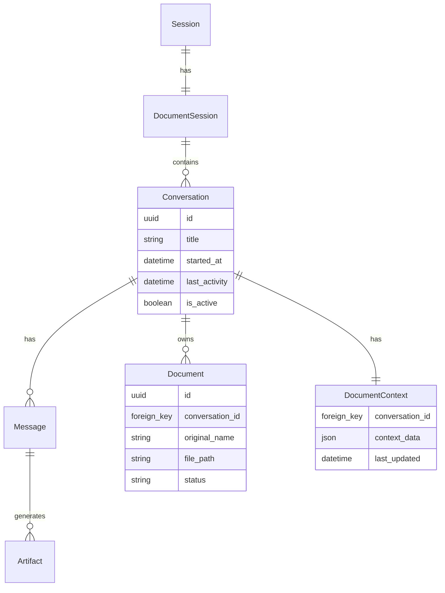
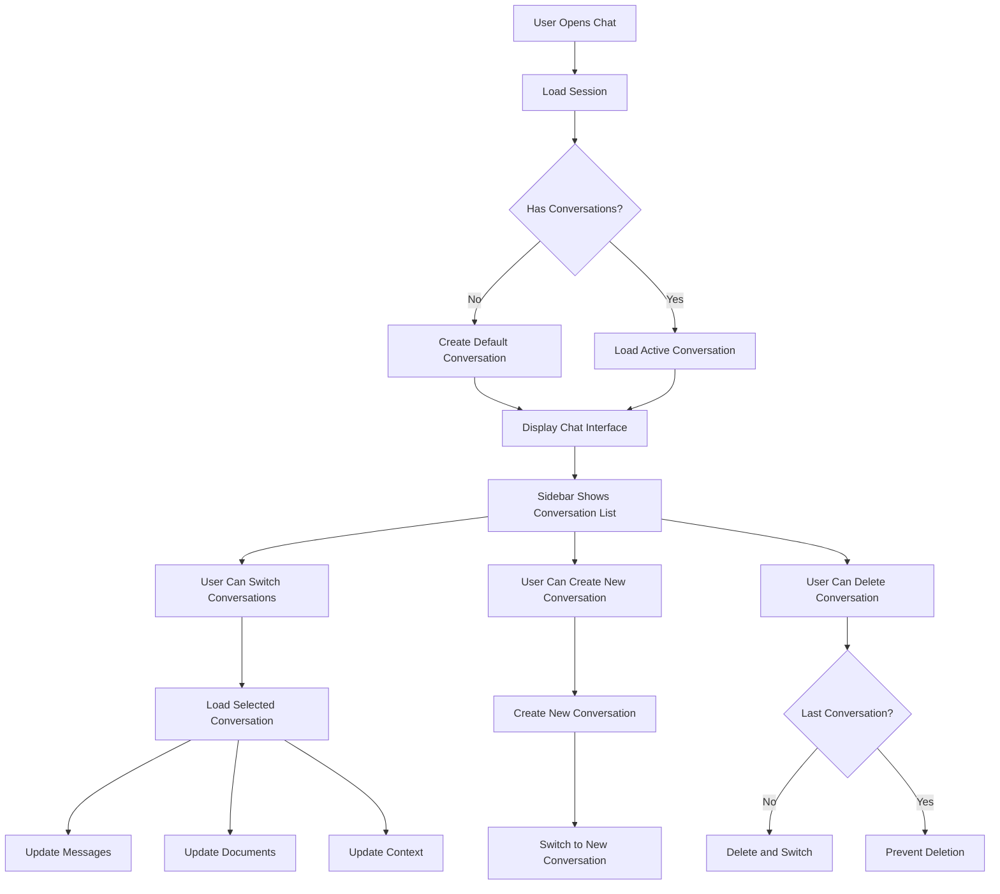

# Multi-Conversation System Architecture

## Overview
The multi-conversation system will allow users to maintain multiple separate chat conversations within a single browser session. Each conversation will have its own documents, messages, and context.

## Data Model Changes



## User Interface Flow



## Key Features

### 1. Conversation Management
- **Create**: Users can create new conversations with auto-generated or custom titles
- **Switch**: Click on any conversation in the sidebar to switch
- **Delete**: Remove conversations (except if it's the last one)
- **Rename**: Edit conversation titles inline

### 2. Document Isolation
- Each conversation maintains its own document collection
- Documents uploaded in one conversation are not visible in others
- Document count limits apply per conversation

### 3. Persistence
- Conversations are saved automatically
- Last active conversation is remembered and restored on page reload
- Message history is preserved per conversation

### 4. UI Components

#### Sidebar Enhancement
```
┌─────────────────────────┐
│ 📂 Documents            │
├─────────────────────────┤
│ [Upload Zone]           │
├─────────────────────────┤
│ 💬 Conversations        │
├─────────────────────────┤
│ [+ New Conversation]    │
├─────────────────────────┤
│ ▶ Sales Analysis       │
│   "Can you analyze..."  │
│   2 docs • 5 min ago    │
├─────────────────────────┤
│ ▶ Product Research     │
│   "Compare these..."    │
│   3 docs • 1 hour ago  │
├─────────────────────────┤
│ ▶ Meeting Notes        │
│   "Summarize the..."    │
│   1 doc • Yesterday    │
└─────────────────────────┘
```

## Implementation Phases

### Phase 1: Backend Model Changes
- Update models to support conversation relationships
- Create migrations
- Update DocumentContext to work per conversation

### Phase 2: API Endpoints
- Create/Delete/Rename conversations
- Switch active conversation
- List conversations for session

### Phase 3: Frontend Updates
- Add conversation list to sidebar
- Implement conversation switching
- Update document upload flow

### Phase 4: Testing & Polish
- Test multi-conversation workflows
- Add visual polish and animations
- Implement auto-cleanup for old conversations