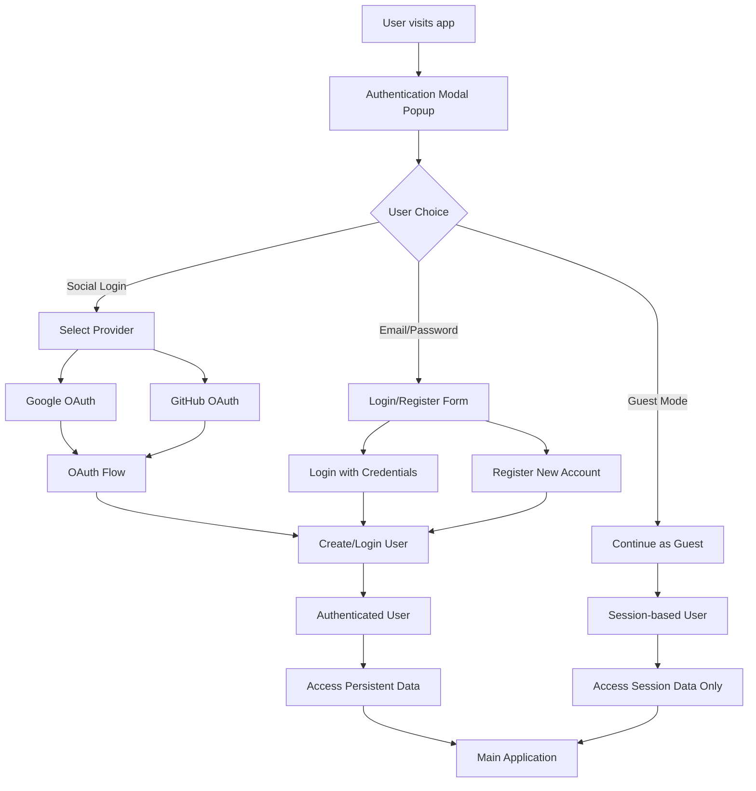
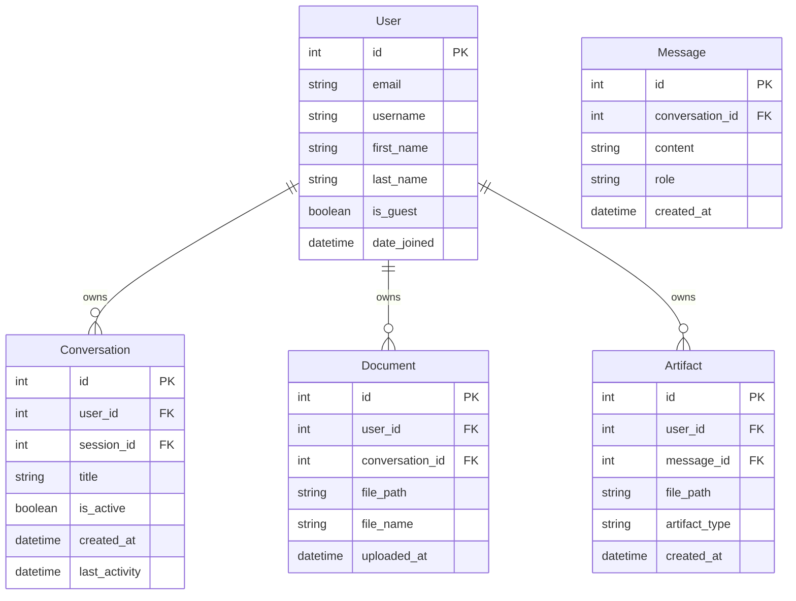

# Authentication System Architecture

## Overview
The authentication system will provide three ways for users to access the Ultra PDF Chatbot 3000:
1. **Social Authentication** - Login with Google or GitHub
2. **Email/Password Authentication** - Traditional registration and login
3. **Guest Mode** - Continue without authentication (session-based data only)

## Authentication Flow Diagram

## Data Model Changes

## Key Components

### 1. Authentication Modal
- Appears on first visit
- Built with Alpine.js for interactivity
- HTMX for seamless form submissions
- Three clear options: Social login, Email/Password, Guest mode

### 2. Django-Allauth Integration
- Handles social authentication providers
- Manages email verification
- Provides account management views

### 3. User Model Extension
- Custom User model extending AbstractUser
- `is_guest` field to distinguish guest users
- Links to all user-generated content

### 4. Middleware Layer
- Checks authentication status
- Redirects unauthenticated users to login modal
- Manages guest session conversion to authenticated user

### 5. Data Migration Strategy
- Preserve existing session-based data
- Allow guests to claim their data when registering
- Link orphaned data to new user accounts

## Security Considerations

1. **OAuth Security**
   - Secure storage of client secrets in environment variables
   - HTTPS required for production OAuth callbacks
   - CSRF protection on all forms

2. **Session Management**
   - Secure session cookies
   - Session expiry for guest users
   - Remember me functionality for authenticated users

3. **Data Privacy**
   - Guest data cleaned up after session expiry
   - User data encryption at rest
   - GDPR compliance for user data deletion

## User Experience Flow

1. **First Visit**
   - Modal appears with authentication options
   - Clear explanation of benefits for each option
   - Easy guest mode access

2. **Guest to User Conversion**
   - Prompt to save work when guest performs significant actions
   - Easy upgrade path from guest to registered user
   - Data preservation during conversion

3. **Returning Users**
   - Automatic login if "Remember me" was selected
   - Quick access to previous conversations and documents
   - Profile management in sidebar

## Technology Stack

- **Backend**: Django + Django-Allauth
- **Frontend**: Alpine.js + HTMX + Tailwind CSS
- **Authentication**: OAuth 2.0 (Google, GitHub) + Django Auth
- **Database**: SQLite (development) / PostgreSQL (production)